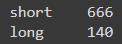
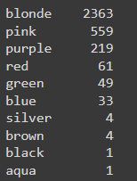
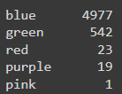

# NFE

## Table of contents
- [Table of content](#table-of-contents)
- [Description](#description)
- [Authors](#Authors)
- [References](#references)

## Description
NFE is a tool that allows anyone to edit their anime pictures using Deep Learning to change attributes such as hair colour, hair length, eye colour etc.

The project is mainly inspired by works on interpreting the latent space of GANs for people face generation [1] and other methods of manipulating GAN output [2]. 
It leverages techniques mentioned in the papers to edit real users’ photos, change multiple image features, and preserve the general image content. 
These features for editing would probably include hair colour, eye colour, etc., which are not explored in the previous works.

## Current results
Sample generated images, produced by GAN:  

Current results are far from perfect, but we will try to fix it in the future. Possible solutions are to try different, bigger dataset or to change model architecture.

As we stated before, we generated and labelled 10K samples. The dataset statistics is the following (the rest of values is NaN):
- Hair length  
  
- Hair colour  
  
- Eye colour  
  
  
As we can see, there are a lot of NaN values. This is because the results are far from realistic ones and tagging tool is not 100% accurate (as it is a neural network)

In the future work , we may consider adding other attributes such as “Smile” and “Blush” or even “Quality” (to fix the artifacts) made by GAN.

## Authors
Andrey Palaev, a.palaev@innopolis.university  
Mikhail Rudakov, m.rudakov@innopolis.university  
Anna Startseva, a.startseva@innopolis.university

## References
[1] Shen, Y., Gu, J., Tang, X., & Zhou, B. (2019). Interpreting the Latent Space of GANs for Semantic Face Editing. arXiv. https://doi.org/10.48550/arXiv.1907.10786  
[2] Upchurch, P., Gardner, J., Pleiss, G., Pless, R., Snavely, N., Bala, K., & Weinberger, K. (2016). Deep Feature Interpolation for Image Content Changes. arXiv. https://arxiv.org/abs/1611.05507v2
